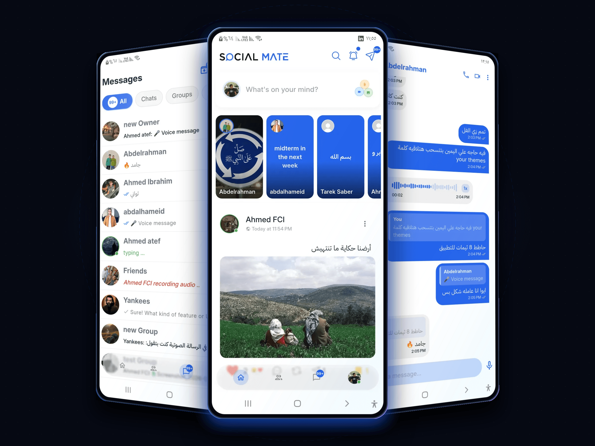
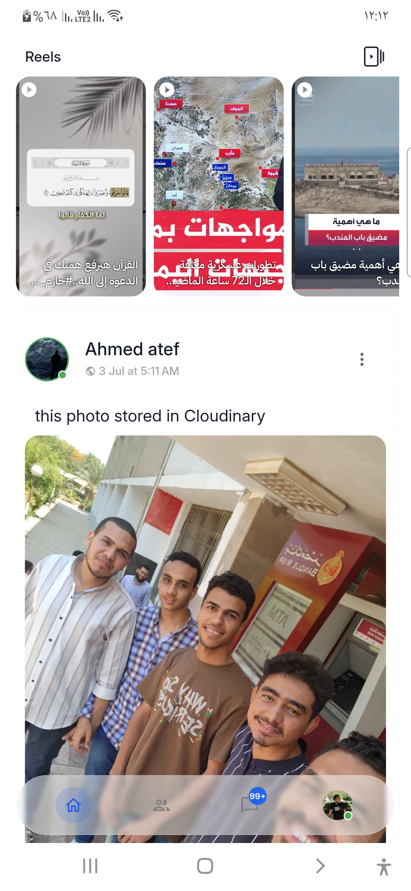
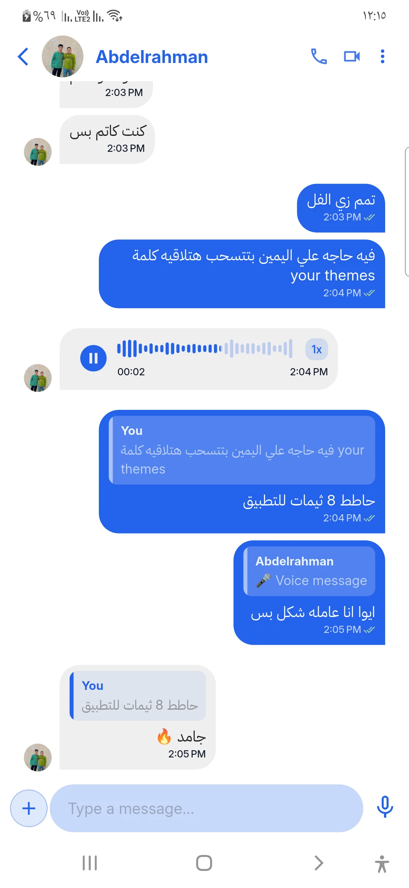
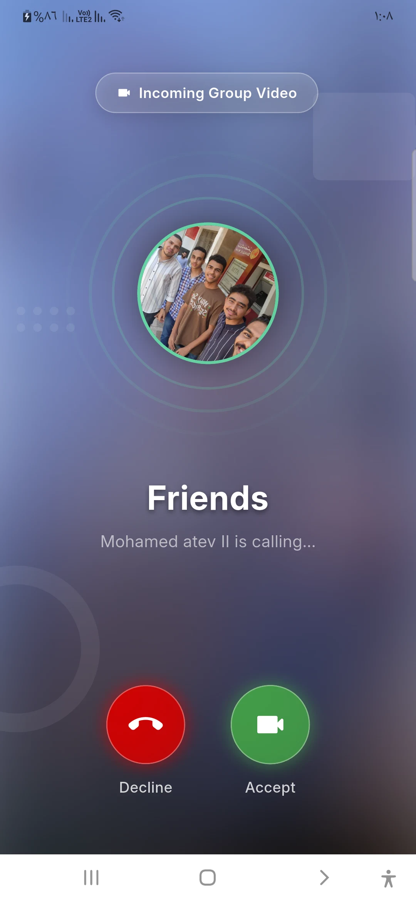
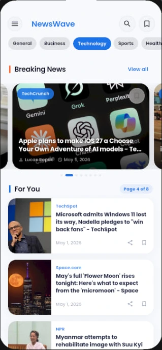
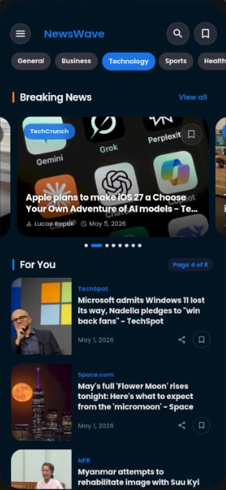
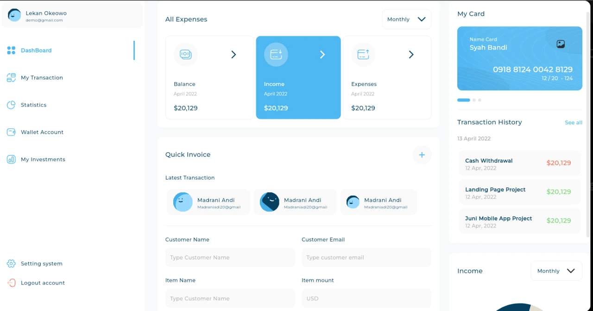
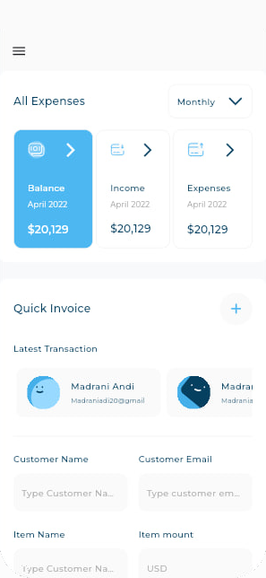
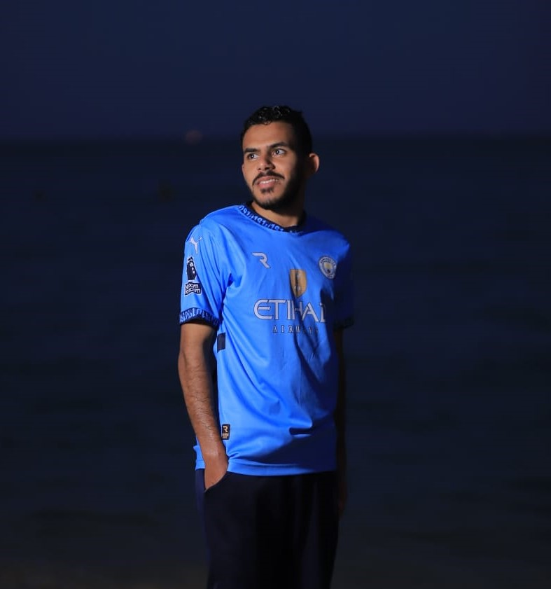

<div align="center">

# ⚡ Ahmed Atef — Native & Mobile Engineering Portfolio

<p align="center">
  <strong>A cinematic, high-performance web platform showcasing production-grade Flutter engineering, complex system architectures, and deep technical case studies.</strong>
</p>

[](https://nextjs.org/)
[](https://react.dev/)
[](https://tailwindcss.com/)
[](https://www.typescriptlang.org/)
[](https://motion.dev/)
[](https://flutter.dev/)
[](https://supabase.com/)
[](https://livekit.io/)
[](./LICENSE)

---

### [🌐 Live Demo](https://ahmedatef.dev) &nbsp;•&nbsp; [📱 Featured Projects](#-showcased-engineering-projects) &nbsp;•&nbsp; [🏗️ Architecture](#️-web-portfolio-architecture--highlights) &nbsp;•&nbsp; [🎨 Design System](#-brand-identity--color-harmony) &nbsp;•&nbsp; [🚀 Quick Start](#-quick-start--local-development) &nbsp;•&nbsp; [📬 Contact](#-engineer-profile--connect)

---

<br />



</div>

<br />

## 📖 Table of Contents

- [Executive Summary](#-executive-summary)
- [Web Portfolio Architecture & Highlights](#️-web-portfolio-architecture--highlights)
- [Showcased Engineering Projects](#-showcased-engineering-projects)
  - [1. Social Mate — Flagship AI Social Platform](#1-social-mate--flagship-ai-augmented-social--calling-platform)
  - [2. NewsWave — Bilingual Offline-First News Reader](#2-newswave--bilingual-offline-first-news--translation-engine)
  - [3. FinDash — Multi-Breakpoint Financial Dashboard](#3-findash--adaptive-multi-breakpoint-financial-dashboard)
- [Brand Identity & Color Harmony](#-brand-identity--color-harmony)
- [Repository Structure](#-repository-structure)
- [Tech Stack Breakdown](#-tech-stack-breakdown)
- [Quick Start & Local Development](#-quick-start--local-development)
- [Performance, A11y & Engineering Standards](#-performance-a11y--engineering-standards)
- [Engineering Philosophy](#-engineering-philosophy)
- [Engineer Profile & Connect](#-engineer-profile--connect)
- [License](#-license)

---

## 🌟 Executive Summary

**ahmed-native-portfolio** is a bespoke, state-of-the-art web application built from the ground up using **Next.js 16**, **React 19**, **Tailwind CSS v4**, and **Motion**. Designed with a cinematic obsidian-and-luminous-blue glassmorphic aesthetic, it functions as the definitive engineering portal for **Ahmed Atef**, highlighting:

1. **Production-Grade Flutter Applications**: In-depth, interactive case studies for large-scale mobile applications featuring Clean Architecture, WebRTC real-time calling, multi-provider AI integrations, offline-first sync engines, and responsive layout orchestrations.
2. **Interactive Hardware Simulation**: Realistic mobile (iOS/Android) and tablet device frames with interactive feature carousels, live video demonstration playback, and high-resolution lightbox inspection.
3. **Multi-ABI APK Distribution Center**: Integrated release manager providing verified direct downloads for multiple CPU architectures (`arm64-v8a`, `armeabi-v7a`, `x86_64`, `universal`) accompanied by SHA256 integrity checksums.
4. **Architectural Transparency**: Technical deep-dives covering trade-offs, engineering bottlenecks, state management strategies, and database indexing solutions.

---

## ⚙️ Web Portfolio Architecture & Highlights

```
┌─────────────────────────────────────────────────────────────────────────────┐
│                             NEXT.JS 16 APP ROUTER                           │
├─────────────────────────────────────────────────────────────────────────────┤
│  App Layer (RSC + SSG)     │  /app (RootLayout, Home, /projects, /[slug])  │
│  Theming & Ambient State   │  next-themes (Obsidian Dark / Crisp Slate Light)│
│  Design System             │  Tailwind CSS v4 + Fluid Clamp Typography Scale│
│  Micro-Interactions        │  Motion (Hardware-accelerated Springs & Tilt)  │
│  Hardware Simulation       │  Custom DeviceFrame (iOS, Android, Tablet)     │
│  Media Pipeline            │  WebP / AVIF Optimization + Inline Video Player│
│  Download Engine           │  Direct GitHub Release Integration + SHA256    │
└─────────────────────────────────────────────────────────────────────────────┘
```

### Key Technical Pillars

- **⚡ Cutting-Edge Stack**: Powered by **Next.js 16.3** with Turbopack, **React 19**, and the freshly redesigned **Tailwind CSS v4** engine.
- **🌌 Dual-Tier Glassmorphic Surfaces**: Custom-crafted `@utility glass-panel` and `glass-panel-strong` utilizing `backdrop-filter: blur(28px) saturate(180%)`, ambient radial light fields, and luminous blue boundary gradients.
- **📱 Responsive Hardware Mockup Component**: Custom `<DeviceFrame />` component providing pixel-perfect bezels, speaker notches, and aspect ratios across iPhone, Android flagship devices, and tablets.
- **🎛️ Fluid Responsive Typography**: Zero layout jump typography engineered using CSS `clamp()` utilities (`type-display`, `type-headline`, `type-title`, `type-lead`, `type-eyebrow`) ensuring optimal readability from small smartphones to 4K displays.
- **♿ Inclusive Motion & Accessibility**: Full detection and compliance with user system preferences via `usePrefersReducedMotion`, eliminating motion sickness while preserving responsive UI transitions.
- **🛡️ Enterprise Security Headers**: Pre-configured HTTP protection headers in `next.config.ts` including `X-Content-Type-Options: nosniff`, `X-Frame-Options: SAMEORIGIN`, and strict `Permissions-Policy`.

---

## 🚀 Showcased Engineering Projects

The portfolio showcases three production-grade engineering masterworks:

```
┌─────────────────┬──────────────────────────────────┬──────────────────────────────────────────┐
│ Project         │ Primary Architecture             │ Key Technologies                         │
├─────────────────┼──────────────────────────────────┼──────────────────────────────────────────┤
│ 🟣 Social Mate  │ Feature-First Clean Architecture │ Flutter · Supabase · LiveKit · FCM · AI  │
│ 🔵 NewsWave     │ Offline-First Clean Architecture │ Flutter · BLoC · Hive · Dio · Supabase   │
│ 🟢 FinDash      │ Adaptive Multi-Breakpoint Layout │ Flutter Web · Cubit · FL Chart · PDF/CSV │
└─────────────────┴──────────────────────────────────┴──────────────────────────────────────────┘
```

---

### 1. Social Mate — Flagship AI-Augmented Social & Calling Platform

> **"Connect · Share · Discover · Belong"**  
> *Production-grade, AI-powered social ecosystem with carrier-grade audio/video calling and real-time messaging.*

<div align="center">
  
  &nbsp;&nbsp;
  
  &nbsp;&nbsp;
  
</div>

<br />

#### 🛠️ Technology Stack
`Flutter` • `Dart` • `Supabase (PostgreSQL & Realtime)` • `LiveKit (WebRTC SFU)` • `Firebase (FCM)` • `BLoC / Cubit` • `Hive` • `Multi-Provider AI (Gemini · Groq · OpenRouter)` • `Cloudinary CDN`

#### 💎 Architectural & Engineering Highlights
- **24 Isolated Feature Modules**: Feature-First domain boundaries ensuring strict encapsulation and isolated testability across Auth, Chat, Calls, Feed, Reels, Stories, AI, and Stickers.
- **Carrier-Grade WebRTC Calling**: Engineered with **LiveKit SFU**, supporting 1-on-1 and multi-participant mesh/SFU video/audio rooms, lock-screen full-screen intents via `flutter_foreground_task`, and floating Picture-in-Picture (PiP).
- **Sub-100ms Messaging Engine**: Leverages Supabase Realtime CDC (Change Data Capture) with optimistic UI updates, typing broadcasts, live waveform voice note recording, and threaded replies.
- **Pluggable Multi-Provider AI Gateway**: Dynamic routing layer coordinating **Google Gemini**, **Groq**, and **OpenRouter** with runtime image/vision detection, automated post summarization, and smart replies.
- **Reels & Media Memory Pooling**: Recycled video controller lifecycle avoiding memory spikes during high-velocity vertical feed scrolling.
- **Distribution**: Complete multi-architecture release pipeline with verified SHA256 APK variants (`arm64-v8a`, `armeabi-v7a`, `x86_64`, `universal`).

👉 **[Explore Full Social Mate Case Study](https://github.com/Ahmedatef5O5/Social-Media-App)**

---

### 2. NewsWave — Bilingual Offline-First News & Translation Engine

> **"Intelligent Real-Time News & Article Reader"**  
> *A bilingual (English / Arabic) news application engineered with strict offline resilience and automated translation.*

<div align="center">
  
  &nbsp;&nbsp;
  
  &nbsp;&nbsp;
  
</div>

<br />

#### 🛠️ Technology Stack
`Flutter` • `Dart` • `BLoC / Cubit` • `Hive (Binary & JSON Cache)` • `Supabase (Auth · Database · Storage)` • `Dio & NewsAPI REST` • `LibreTranslate & MyMemory API` • `In-App WebView`

#### 💎 Architectural & Engineering Highlights
- **Dependency-Free Multi-Probe Connectivity**: Built a bespoke lightweight socket reachability checker to eliminate false-positive connection drops common in standard OS-level wrappers.
- **Dual-Strategy Translation Pipeline**: Real-time on-the-fly article translation using a parallel failover matrix between LibreTranslate and MyMemory endpoints.
- **Locale-Namespaced Hive Storage**: Prevents cache contamination between Arabic and English queries while ensuring instant cold-start boot times without network requests.
- **Deep-Link Authentication**: Complete Supabase authentication lifecycle with custom URL scheme interception handling both warm-state and cold-start password recovery tokens.

👉 **[Explore Full NewsWave Case Study](https://github.com/Ahmedatef5O5/News-App)**

---

### 3. FinDash — Adaptive Multi-Breakpoint Financial Dashboard

> **"Next-Generation Financial Analytics UI"**  
> *Adaptive Flutter Web & Desktop dashboard orchestrating multi-breakpoint layouts without uniform scaling artifacts.*

<div align="center">
  
  &nbsp;&nbsp;
  
</div>

<br />

#### 🛠️ Technology Stack
`Flutter (Web, Desktop, Mobile)` • `Dart` • `BLoC / Cubit` • `fl_chart` • `expandable_page_view` • `csv` • `pdf` • `printing` • `SharedPreferences`

#### 💎 Architectural & Engineering Highlights
- **Discrete Breakpoint Layout Trees**: Replaces naive uniform responsive scaling with dedicated layout trees for Mobile (`< 800px`), Tablet (`800px – 1200px`), Desktop (`1200px – 1750px`), and Ultra-Wide displays.
- **Coordinated Scroll Viewports**: Avoided `RenderFlex` unbounded height exceptions through custom sliver orchestration and clamped typography ratios.
- **Interactive Financial Visualizer**: High-density interactive income and expense analytics powered by `fl_chart` with custom tooltips, animated touch feedback, and real-time range filtering.
- **Context-Preserved Export Engine**: Exports live dashboard analytics directly to formatted CSV and multi-page vector PDF documents while retaining the user's active search, sort, and date filters.

👉 **[Explore Full FinDash Case Study](https://github.com/Ahmedatef5O5/responsive_dash_board)**

---

## 🎨 Brand Identity & Color Harmony

The visual identity of this portfolio is rooted in a **Deep Obsidian & Luminous Electric Blue** palette, mirroring the precision, depth, and energy of high-end mobile engineering.

### Color Palette Matrix

| Token | Light Theme | Dark Theme (Default) | Hex Code | Visual Swatch | Purpose |
| :--- | :--- | :--- | :--- | :---: | :--- |
| **Primary** | Refined Blue | Luminous Royal Blue | `#2563eb` / `#3b82f6` | `🟦` | Primary actions, key accents, focus rings |
| **Primary Light** | Soft Sky Blue | Ice Blue | `#60a5fa` / `#93c5fd` | `🩵` | Hover states, radiant halos, subtle indicators |
| **Primary Deep** | Royal Navy | Deep Cobalt | `#1d4ed8` / `#2563eb` | `🔷` | Atmospheric gradient backgrounds, shadows |
| **Accent** | Electric Cyan | Vivid Sky | `#0ea5e9` / `#38bdf8` | `🌐` | Secondary badges, interactive highlights |
| **Teal** | Seafoam Teal | Radiant Mint | `#14b8a6` | `🟩` | Architectural badges, Clean Arch nodes |
| **Success** | Emerald | Bright Emerald | `#10b981` | `🟢` | Availability indicator, verified checksums |
| **Background** | Clean Off-White | Deep Space Obsidian | `#f8fafc` / `#060913` | `⬛` | Root page canvas and viewport baseline |
| **Surface** | Crisp Pure White | Midnight Slate Glass | `#ffffff` / `#0a0e1c` | `🪟` | Card containers, interactive device backdrops |
| **Border** | Subtle Gray | Translucent Navy Slate| `#e2e8f0` / `#1e293b` | `◽` | Boundary dividers, hairline glass frames |

### Glassmorphism System Specs

```css
/* Dark Mode Cinematic Glass Layer */
--glass-bg: rgba(10, 14, 28, 0.55);
--glass-bg-strong: rgba(10, 14, 28, 0.78);
--glass-border: rgba(148, 163, 184, 0.14);
--glass-highlight: rgba(255, 255, 255, 0.06);
--glass-shadow: 0 1px 0 rgba(255, 255, 255, 0.06) inset, 
               0 30px 60px -25px rgba(0, 0, 0, 0.65);
```

---

## 📂 Repository Structure

The codebase is organized following a strict modular architecture, keeping UI components, domain data, and utilities cleanly decoupled:

```
ahmed_native_portfolio_web/
├── public/
│   ├── assets/
│   │   ├── profile/              # High-resolution author portraits & avatars
│   │   └── projects/             # Real WebP screenshots, GIFs & MP4 walkthroughs
│   │       ├── fin-dash/         # Responsive layout captures & dashboard mockups
│   │       ├── news-wave/        # RTL/LTR previews & offline demonstration clips
│   │       └── social-mate/      # 100+ production screenshots, reels & call media
├── src/
│   ├── app/                      # Next.js 16 App Router Directory
│   │   ├── layout.tsx            # Global root layout, font loaders & metadata base
│   │   ├── page.tsx              # Main showcase landing page
│   │   ├── globals.css           # Tailwind v4 directives, glass tokens & typography
│   │   ├── opengraph-image.tsx   # Dynamic OpenGraph social card generator
│   │   └── projects/             # Projects Archive & Case Studies
│   │       ├── page.tsx          # Full catalog of featured works & flagship banner
│   │       └── [slug]/           # Dynamic case study route
│   │           ├── page.tsx      # Comprehensive project case study template
│   │           └── opengraph-image.tsx # Dynamic per-project OG card generator
│   ├── components/
│   │   ├── home/                 # Homepage-specific showcase sections
│   │   │   ├── hero.tsx          # Orbital hero with atmospheric light fields
│   │   │   ├── social-mate-showcase.tsx # Interactive feature & device switcher
│   │   │   ├── selected-projects.tsx    # Secondary project showcase grid
│   │   │   ├── about-section.tsx        # Technical background & skills matrix
│   │   │   ├── engineering-philosophy.tsx # Architectural principles cards
│   │   │   └── contact-section.tsx      # Actionable contact hub
│   │   ├── layout/               # Global persistent layout components
│   │   │   ├── navbar.tsx        # Scroll-aware dynamic header & navigation
│   │   │   └── footer.tsx        # Footer with social links & copyright
│   │   ├── projects/             # Case study view components
│   │   │   ├── case-study-hero.tsx      # Cinematic project header with backdrop
│   │   │   ├── case-study-overview.tsx  # Executive synopsis & positioning
│   │   │   ├── architecture-section.tsx # Visual Clean Architecture layer trees
│   │   │   ├── engineering-section.tsx  # Technical decisions & challenge solutions
│   │   │   ├── gallery.tsx              # Filterable lightbox media browser
│   │   │   ├── download-center.tsx      # Direct APK releases with SHA256 verification
│   │   │   └── final-cta.tsx            # Case study outro & next-project navigation
│   │   ├── theme-provider.tsx    # Client-side theme provider (next-themes)
│   │   └── ui/                   # Reusable primitive design system components
│   │       ├── device-frame.tsx  # Hardware mockup engine (iOS / Android / iPad)
│   │       ├── media-preview.tsx # Unified image/video preview player
│   │       └── reveal.tsx        # Intersection-based motion entrance wrappers
│   ├── data/
│   │   ├── profile.ts            # Author biography, skills matrix & social endpoints
│   │   ├── projects.ts           # Comprehensive database of projects & case studies
│   │   └── schemas.ts            # Strongly-typed TypeScript interfaces & models
│   ├── hooks/
│   │   └── use-prefers-reduced-motion.ts # Accessibility hook for motion control
│   └── lib/
│       └── utils.ts              # Tailwind CSS class merging utility (`clsx` + `twMerge`)
├── next.config.ts                # Next.js optimization, security headers & image rules
├── postcss.config.mjs            # PostCSS configuration for Tailwind CSS v4
├── tsconfig.json                 # TypeScript compiler options (strict mode enabled)
└── package.json                  # Dependencies, build scripts & metadata
```

---

## 💻 Tech Stack Breakdown

### Frontend Core & Platform

| Package | Version | Purpose |
| :--- | :---: | :--- |
| **Next.js** | `^16.3.4` | App Router, Server Components, Static Site Generation (SSG), Turbopack |
| **React** | `19.2.8` | Component rendering engine with concurrent capabilities |
| **TypeScript** | `^5.0.0` | End-to-end static type safety and IntelliSense |

### Styling, Design System & Theming

| Package | Version | Purpose |
| :--- | :---: | :--- |
| **Tailwind CSS** | `^4.0.0` | Utility-first CSS engine with fluid typography and inline theme variables |
| **next-themes** | `^0.4.6` | Persistent dark/light theme switching with zero hydration flicker |
| **clsx** & **tailwind-merge** | Latest | Deterministic, conflict-free class name composition |

### Animation, Interaction & Icons

| Package | Version | Purpose |
| :--- | :---: | :--- |
| **Motion** | `^13.1.1` | Hardware-accelerated spring animations, drag, and scroll-linked motion |
| **Lucide React** | `^1.39.0` | Ultra-clean, modern iconography |
| **React Icons** | `^5.7.0` | Brand social icons (GitHub, LinkedIn, WhatsApp, Gmail) |

### Asset & Graphic Processing

| Package | Version | Purpose |
| :--- | :---: | :--- |
| **@napi-rs/canvas** | `^1.0.9` | High-performance server-side graphic generation for dynamic OG cards |

---

## ⚡ Quick Start & Local Development

Follow these steps to run the portfolio web application locally on your machine:

### 1. Prerequisites

Ensure you have the following installed:
- **Node.js**: `18.18.0` or higher (Node `20.x` or `22.x` recommended)
- **Package Manager**: `npm` (bundled with Node), `pnpm`, or `yarn`
- **Git**: Installed and configured on your system

### 2. Clone the Repository

```bash
git clone https://github.com/Ahmedatef5O5/ahmed-native-portfolio.git
cd ahmed_native_portfolio_web
```

### 3. Install Dependencies

```bash
npm install
# or
pnpm install
# or
yarn install
```

### 4. Run the Development Server

```bash
npm run dev
```

Open your browser and navigate to **[http://localhost:3000](http://localhost:3000)** to experience the portfolio live.

### 5. Available Scripts

| Command | Action | Description |
| :--- | :--- | :--- |
| `npm run dev` | Start Dev Server | Launches Next.js dev server with Turbopack at `localhost:3000` |
| `npm run build` | Production Build | Compiles TypeScript, runs static generation (SSG) for all routes |
| `npm run start` | Production Server | Serves the optimized production build |
| `npm run lint` | Lint Validation | Runs ESLint 9 to verify code hygiene and style adherence |
| `npm run repomix`| Repo Packing | Bundles project context for documentation and analysis |

---

## 🛡️ Performance, A11y & Engineering Standards

The portfolio was engineered to meet the highest industry standards for modern web engineering:

- **🚀 100% Static Generation (SSG)**: All project routes and dynamic slug pages are pre-rendered at build time via `generateStaticParams()`, resulting in instant TTFB (Time to First Byte).
- **🖼️ Next-Gen Media Optimization**: Images and videos are served exclusively using modern WebP and AVIF formats with custom `sizes` attributes, eliminating Cumulative Layout Shift (CLS).
- **🔤 Self-Hosted Variable Typography**: Integrated `next/font` for Google's `Inter` and `Space Grotesk` fonts with zero third-party font network requests.
- **♿ Motion Sensitivity Compliance**: All continuous orbital animations and floating effects respect the user's operating system `prefers-reduced-motion` settings.
- **🔒 Secure Transport**: Hardened with strict security headers including `nosniff`, `SAMEORIGIN`, and explicit referrer policies.

---

## 💡 Engineering Philosophy

```
  ┌──────────────────────────────────────────────────────────┐
  │ 1. Architecture as a Foundation                          │
  │    Structure code so complexity stays manageable as the  │
  │    product scales. Feature-First domain isolation.       │
  ├──────────────────────────────────────────────────────────┤
  │ 2. Design for Failure                                    │
  │    Network resilience isn't an afterthought. Products    │
  │    handle captive portals, stale caches, and rate limits │
  │    gracefully by construction.                           │
  ├──────────────────────────────────────────────────────────┤
  │ 3. Engineering Serves UX                                 │
  │    Performance is a feature. Avoiding layout shifts,     │
  │    optimizing animations, and reactive state management  │
  │    directly elevate perceived product quality.           │
  └──────────────────────────────────────────────────────────┘
```

---

## 👨‍💻 Engineer Profile & Connect

<div align="center">

<!--  -->

### **Ahmed Atef**
**Flutter Developer & Mobile Systems Engineer**  
*Building production-grade digital products with Clean Architecture & Realtime Scalability.*

<br />

[](https://github.com/Ahmedatef5O5)
[](https://www.linkedin.com/in/ahmed-ateif-00b77b28a/)
[](https://wa.me/201550835238)
[](mailto:ahmedateif0@gmail.com)

</div>

---

## 📄 License

This project is licensed under the **MIT License** — see the [LICENSE](./LICENSE) file for details.  
All showcased project media, trademarks, and brand assets are the property of their respective creators.

---

<div align="center">
  <sub>Crafted with passion using <strong>Next.js 16</strong>, <strong>Tailwind CSS v4</strong> & <strong>Flutter</strong>. © 2026 Ahmed Atef. All rights reserved.</sub>
</div>
